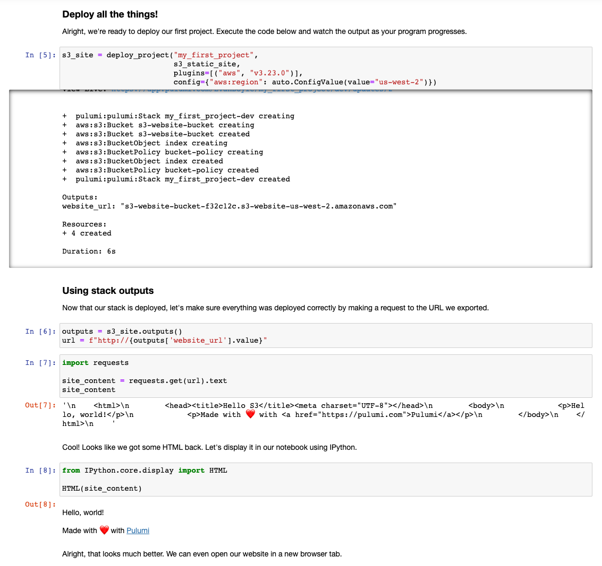

# Pulumi Via Jupyter

This project explores running Pulumi through a Jupyter Notebook.



To run this example you'll need a few pre-reqs:
1. A Pulumi CLI installation ([v2.10.1](https://www.pulumi.com/docs/get-started/install/versions/) or later)
2. The AWS CLI, with appropriate credentials.

### Set up your virtual environment

1. ```shell
   $ python3 -m venv venv
   ```
2. ```shell
   $ venv/bin/python3 -m pip install --upgrade pip
   ```
3. ```shell
   $ venv/bin/pip install -r requirements.txt
   ```

### Running a notebook

1. Start up the notebook server. This will open up the directory in your default browser.
   ```shell 
   $ venv/bin/jupyter notebook
   ```
2. Click on a notebook (`.ipynb` file) to open it up.
3. Work through the notebook by running each cell in order. You can run a cell with `Shift + Enter` or by using the Play button at the top of the notebook.
